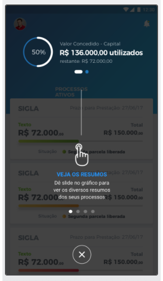

# Tour Component

Componente que cria um overlay, destacando algum elemento da tela, para exemplificar/explicar algo.



## Como instalar?
* Utilize o comando:
```sh
npm install @mbamobi/tour-component
```

## Como utilizar?

```typescript
import { NgModule } from '@angular/core';
import { IonicApp, IonicModule } from 'ionic-angular';
import { MyApp } from './app.component';

import { TourComponentModule } from '@mbamobi/tour-component';

@NgModule({
  declarations: [
    MyApp
  ],
  imports: [
    IonicModule.forRoot(MyApp),
    TourComponentModule
  ],
  bootstrap: [IonicApp],
  entryComponents: [
    MyApp
  ]
})
```

Na page (.ts) onde se quer colocar, refereciar o(s) elemento(s) a ser(em) colocardo(s) no overlay. E carregar os passos do tutorial:

```typescript
@ViewChild('elemento') elemento;
@ViewChild('elemento2') elemento2;

...

carregarTour() {
  let step1 = new Step();
  step1.addHighlight(new Highlight(this.elemento.getElementRef(), {
    cls: 'tour-elemento',
    title: 'Titulo elemento',
    description: 'Lorem ipsum dolor sit amet, consectetur adipiscing elit.',
    event: {
      before: () => this.content.scrollTo(0, 0)
    }
  }));
  let step2 = new Step();
  step2.addHighlight(new Highlight(this.elemento2.getElementRef(), {
    cls: 'tour-elemento-2',
    title: 'Titulo elemento 2',
    description: 'Lorem ipsum dolor sit amet, consectetur adipiscing elit.',
    event: {
      before: () => this.content.scrollTo(0, 0)
    },
    pointerToHighlight: true //este parâmetro insere uma div após o elemento (dentro do overlay).
  }));
  let tour = this.tourCtrl.create({steps: [ step1, step2 ], showCloseOnlyOnLastPage: true});
  tour.present();
}

```
